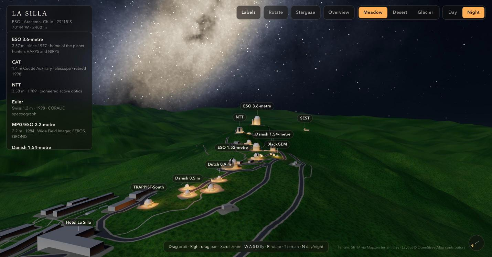

# La Silla Observatory in 3D

A navigable three.js model of ESO's La Silla Observatory in Chile (29°15′S, 70°44′W, 2400 m), with a day/night switch, a Milky Way night sky, moonlight, domes lit in soft amber, switchable weather and three ground surfaces.

**Live: <https://helmutqualtinger.github.io/LaSilla/>** · Source: <https://github.com/HelmutQualtinger/LaSilla>



## Run it

Use the live page above, or open `index.html` in a browser. It needs an internet connection, because three.js is loaded from a CDN.

If the page does not load when opened directly, serve the folder instead:

```sh
python3 -m http.server 8377
```

Then open <http://127.0.0.1:8377/>.

## Controls

| Input | Action |
|---|---|
| Drag / right-drag / scroll | Orbit / pan / zoom |
| Drag upward, past the horizon | Tilt the view up, as far as the zenith; the camera settles on the ground and looks around from there |
| `W` `A` `S` `D` or arrow keys | Fly |
| `N` | Day / night |
| `T` | Cycle ground: meadow, desert, glacier |
| `1` `2` `3` `4` | Toggle clouds, rain, snow, fog (they combine) |
| `F` | Follow me: ride along behind one of the Teslas; press again to let go |
| `M` | Music: the sunrise fanfare from Richard Strauss's *Also sprach Zarathustra* (starts by itself with your first click, tap or key press, plays once; `M` stops or restarts it) |
| `G` | Stargaze: stand on the ridge and look up at the galactic core |
| `H` | Back to the overview |
| `L` | Toggle labels |
| `R` | Toggle the automatic orbit (on at start) |

Click a label, or a name in the list on the left, to fly to that telescope.

On a phone, drag with one finger to orbit, pinch to zoom, drag with two fingers to pan, and tap a label to fly to a telescope. The button at the top left opens the building list; the one at the top right opens the settings menu.

Add flags to the URL to start in a given state, for example `index.html#day`, `#desert`, `#snow` or `#day-desert-fog-still`. The page opens at night on the glacier surface; the flags are `day`, `still` (start without the automatic orbit), `meadow`, `desert`, `glacier`, `clouds`, `rain`, `snow`, `fog` and `mute` (no automatic music).

## What is real and what is not

- **Real:** the terrain (SRTM elevation data), the positions and footprints of the buildings, and the roads (OpenStreetMap). The night sky: about 25,800 stars down to magnitude 7.5 from the HYG catalogue, with their real positions, brightness and colour, and about 1,050 galaxies down to magnitude 12 from OpenNGC, drawn at their catalogue position, axis ratio and orientation. The main constellations are traced with faint red lines between their catalogue stars. The sky is oriented for La Silla's latitude.
- **Stylised:** the telescope buildings are simplified shapes, not architectural replicas. The glow of the Milky Way, the two Magellanic Clouds and the Carina nebula are procedural, placed at their real positions. Galaxies are drawn far brighter and about twice as large as they really appear (and never smaller than a few pixels), and tinted red so they stand out from the stars.
- **Artistic licence:** the amber lighting (a working observatory is kept dark), the meadow and glacier surfaces, the weather, the Teslas on the roads, and the constantly turning SEST dish and 3.6 m dome (SEST was retired in 2003). The real mountain is desert and has clear skies most nights of the year.

## Files

| File | Contents |
|---|---|
| `index.html` | The whole application: markup, styles and one script |
| `data.js` | Generated elevation grid and map data; must stay next to `index.html` |
| `sky.js` | Generated star and galaxy catalogue data; must stay next to `index.html` |
| `zarathustra.mp3` | The music track; must stay next to `index.html` |
| `tools/build_data.py` | Regenerates `data.js` from elevation tiles and OpenStreetMap (needs numpy and Pillow); its inputs are cached in `tools/cache/` |
| `docs/` | README screenshot and `preview.jpg`, the 1200×630 image used for link previews |
| `tools/build_sky.py` | Regenerates `sky.js` (stars, galaxies, constellation figures) from the HYG and OpenNGC catalogues (downloads about 38 MB on first run) |
| `CLAUDE.md` | Architecture notes for working on the code |
| `PROMPT.md` | A prompt for a coding agent to rebuild this app from scratch |

## Licence

Everything original to this project is released under [CC0 1.0 Universal](LICENSE): the code in `index.html` and `tools/`, the documentation, the prompt and the images in `docs/`. You may copy, change and reuse it for any purpose, including commercially, without asking and without attribution.

CC0 cannot cover material that belongs to others. These parts keep their own terms:

| Part | Licence | What reuse requires |
|---|---|---|
| Map data in `data.js` and `tools/cache/osm.json` (buildings, roads) | ODbL 1.0, © OpenStreetMap contributors | Attribution; share-alike for derived databases |
| Elevation data in `data.js` and `tools/cache/tile_*.png` | SRTM (public domain), via the Mapzen terrain tiles | Attribution requested by the tile provider |
| `sky.js` (stars from HYG, galaxies from OpenNGC) | CC BY-SA 4.0 | Attribution; share-alike |
| `zarathustra.mp3` (Richard Strauss, *Also sprach Zarathustra*, introduction; performed by Kevin MacLeod, incompetech.com) | CC BY 3.0; the composition itself is in the public domain | Attribution |
| three.js, loaded from a CDN, not included here | MIT | Keep its licence notice if you bundle it |

## Data credits

- Terrain: SRTM, via the Mapzen terrain tiles hosted on AWS.
- Buildings and roads: © OpenStreetMap contributors, ODbL.
- Stars: [HYG database](https://github.com/astronexus/HYG-Database) v4.1, CC BY-SA 4.0.
- Galaxies: [OpenNGC](https://github.com/mattiaverga/OpenNGC), CC BY-SA 4.0. The derived `sky.js` is under the same licence.
- Music: Richard Strauss, *Also sprach Zarathustra*, introduction, performed by Kevin MacLeod ([incompetech.com](https://incompetech.com)), [CC BY 3.0](https://creativecommons.org/licenses/by/3.0/). MP3 from [Wikimedia Commons](https://commons.wikimedia.org/wiki/File:Also_Sprach_Zarathustra_-_Einleitung.ogg).
